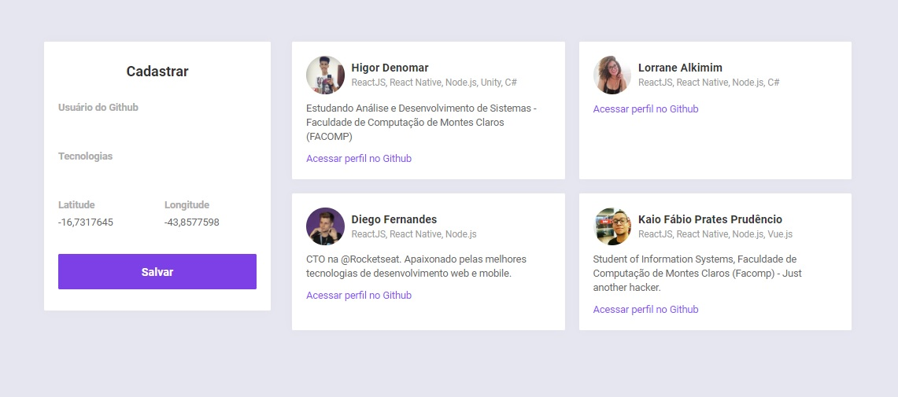
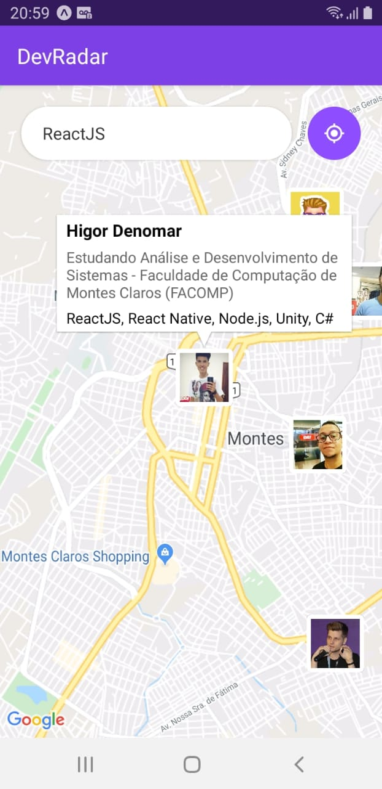
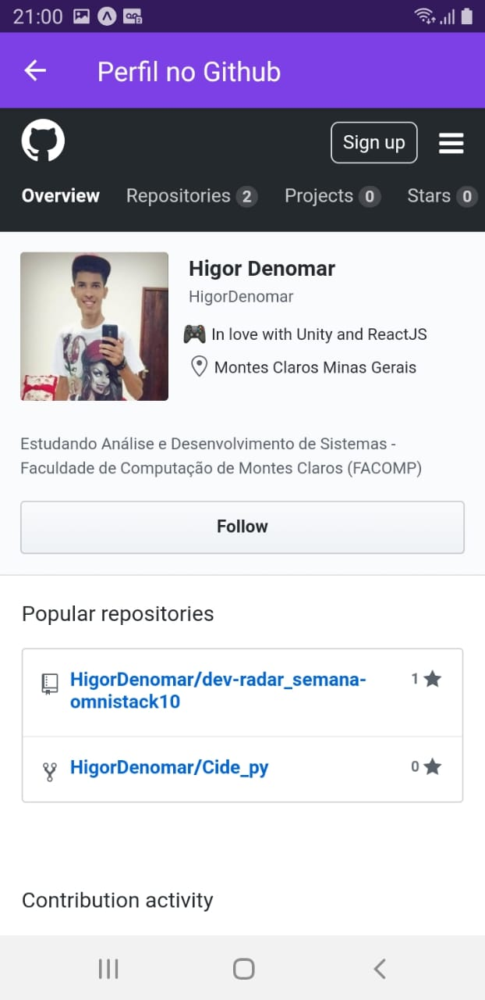

<h3 align="center">
DevRadar 
</h3>

Projeto realizado durante a Semana OmniStack #10 

 &nbsp;

<h2>
O projeto proposto pelo pessoal da <a href="https://github.com/rocketseat">@Rocketseat</a> foi dividido em 3 etapas:
</h2>
 

> **1. Backend**    
Para o backend foi construída uma API RESTful com Node.js.  &nbsp;

> **2. Web**   
O site foi feito com ReactJS, e foi integrado com a API RESTful construída anteriormente.  &nbsp;

> **3. Mobile**    
 O aplicativo foi feito com React Native e Expo CLI, e também foi integrado com a API de forma a buscar os Devs registrados no banco e mostrar no mapa.  &nbsp; 

 &nbsp;
___

- # **Prints Screen:**

  &nbsp; &nbsp; &nbsp; 

---
 &nbsp;
## Funções

* Buscar desenvolvedores no aplicativo:
    * Por Tecnologias
    * Em um raio de 10 km

* Visualização do perfil do Github clicando sobre os desenvolvedores no App;

* Cadastrar novos desenvolvedores pelo site;
* Listar todos os desenvolvedores pelo site;
* Remover desenvolvedores pelo site;

### Techs

* *Backend:* Node.js;

* *Web:* ReactJS;

* *Mobile* React Native;